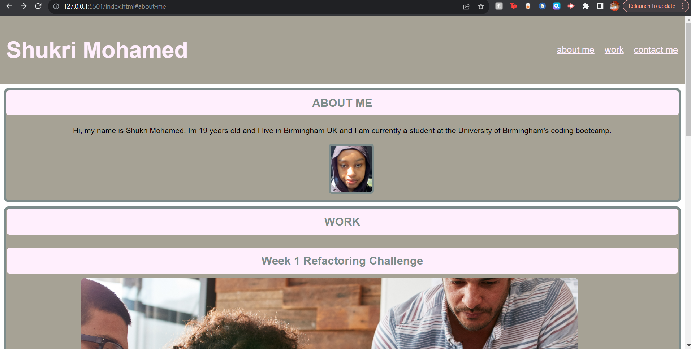
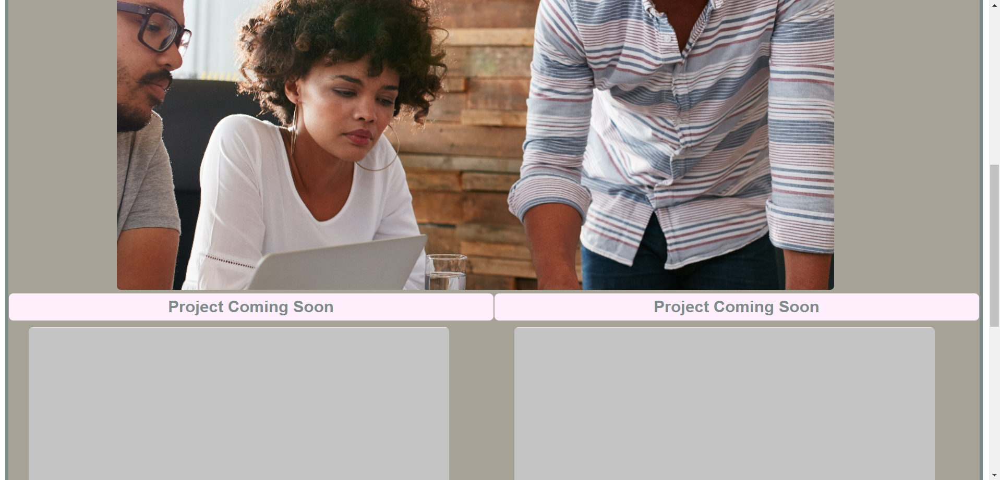
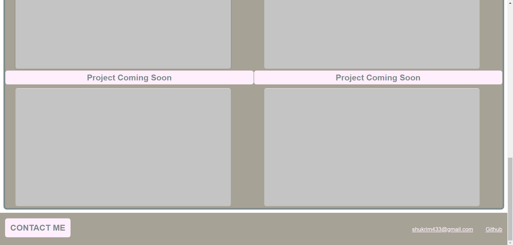

# week-2-portfolio-challenge

## Description

- My motivation for this project was to make something that would enable a potential employer to see all the projects I've worked on in the future. So I made a portfolio that will be able to display all my work in an way that makes it easily accessible. This is so that these future employers can review my portfolio to gauge my abilities and decide on whether or not I am a right fit for the position.

## Process

- The first thing I did was create a wireframe of my portfolio to scaffold the layout of the page.

- I then created my index.html file, style.css file and reset.css file.

- I then wrote out all my html to create the header, navigation bar, 'about-me' section, 'work' section, and 'contact-me' section in the footer.

- Then I styled these sections in css by adding a css variable to contain the main colours and font family of the page. I added borders, margins and paddings to the different sections to separate them.

- I also made it so the hyper links in the navigation bar would take you to each section in the page when they got clicked on by giving each link a href that matched the id attribute of it's corresponding section.

- I also used flex boxes in the header navigation bar and the 'work' main element to make the flex items more spaced out and the layout more presentable.

- My main issue was trying to figure out how to make it so the 5 project sections in the 'work' main element were layed out in a way that made the first project's picture bigger than the rest. At first i tried setting the flex property of the 'project-1' section to "flex: 2 0 0" and the 'other-projects' section to "flex: 1 0 0", but then I realised that created a sort of messy layout with lots of empty spaces. I also tried "flex: 0 0 66.666%" on the 'project-1' section and "flex: 0 0 33.333%" on the 'other-projects' sections, but that gave me the same problem. So the method I landed on was giving 'project-1' a width of 100% and 'other-projects' a width of 50%, this gave a cleaner more even spacing and layout.

- My next challenge was making the page responsive, so I created a media query. This allowed me to adjust the layout and spacing of the elements on the page to fit smaller screens. So I made the header and all the sections in the 'work' main element go into a column when the screen size is 790px or smaller. This makes the layout of the page less cramped.

- I also decided to add some shadow effects on the 'other-headers', the 'project-1' and 'other-projects' sections and the navigation bar hyper links. I did this using the ":hover" pseudo class.

## credits
I got my 'image-1' by taking a screenshot of the deployed webpage of my week one refactoring assignment. https://shukrim433.github.io/week-1-code-refactor-challenge/

## Webpage

These are some screenshots of the portfolio:

This is a link to the deployed webpage: